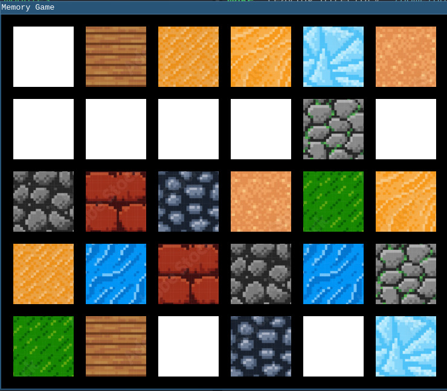
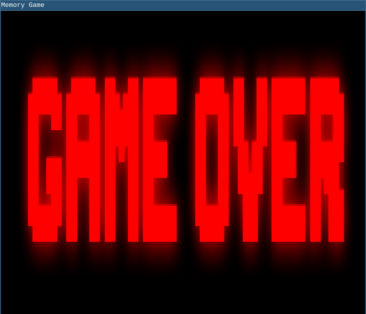

# memorygame
A simple game written in SDL2 Using C++. Purpose of this project was to learn SDL2 and Game Programming constructs.




### Prerequsites
* GCC
* CMake
* SDL2
* SDL2_image

### Instructions
1. Clone the repository to your local machine
```shell
$ git clone https://github.com/aadilshabier/memorygame.git
$ cd memorygame
```
2. Build the project
```shell
$ mkdir build
$ cmake -B build
$ make -C build
```
3. Run the project  
An executable `memorygame` is made inside the `build` directory
```shell
$ ./build/memorygame
```
4. For future builds, just do:
```sh
$ make -C build
```

### Roadmap
- [x] Check if the game has been won
- [x] Fix maxxed out CPU usage
- [x] Make blocks display textures instead of a solid colour
- [ ] Make a starting and ending screen
- [ ] Better game screen (counter, timer, etc)
- [ ] Add background music
- [ ] Make a settings menu
